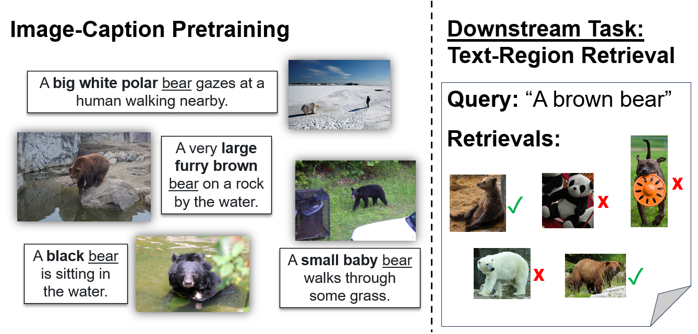

# Investigating the Role of Attribute Context in Vision-Language Models for Object Recognition and Detection (WACV 2024)



This repo currently has code for our proposed text-region retrieval task.

To prep, please install:
- CLIP
- [OpenCLIP](https://github.com/mlfoundations/open_clip)
- PyTorch

And download:
- COCO 2017
- [OVAD](https://ovad-benchmark.github.io/)

Our trained CLIP models are [here](https://drive.google.com/drive/folders/1pgeqKt-U0O0Gh3qhhuKUs6CToW-2DiAV?usp=drive_link).

More code to come!

For citation, please refer as: 
```
@inproceedings{buettner2024investigating,
  title={Investigating the Role of Attribute Context in Vision-Language Models for Object Recognition and Detection},
  author={Buettner, Kyle and Kovashka, Adriana},
  booktitle={Proceedings of the IEEE/CVF Winter Conference on Applications of Computer Vision},
  pages={5474--5484},
  year={2024}
}
```
Also please refer to code that made this work possible:
```
@inproceedings{
  yuksekgonul2023when,
  title={When and why Vision-Language Models behave like  Bags-of-Words, and what to do about it?},
  author={Mert Yuksekgonul and Federico Bianchi and Pratyusha   Kalluri and Dan Jurafsky and James Zou},
  booktitle={International Conference on Learning Representations},
  year={2023},
  url={https://openreview.net/forum?id=KRLUvxh8uaX}
}
```
